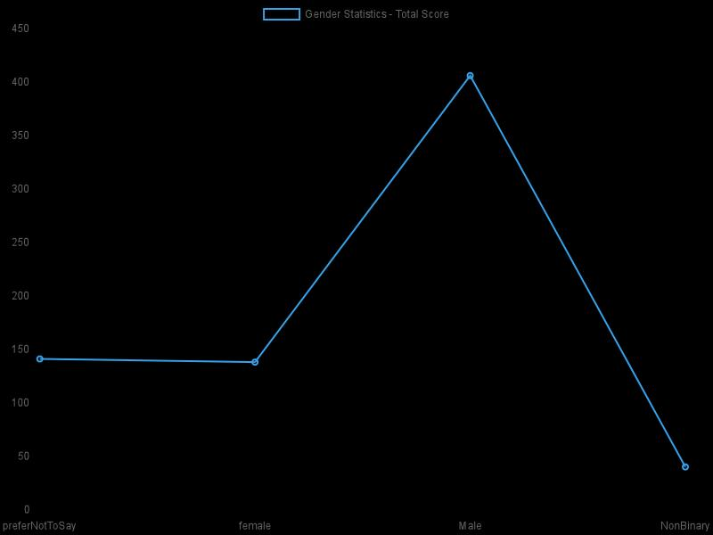
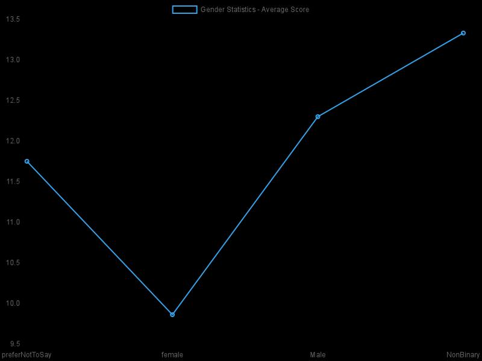
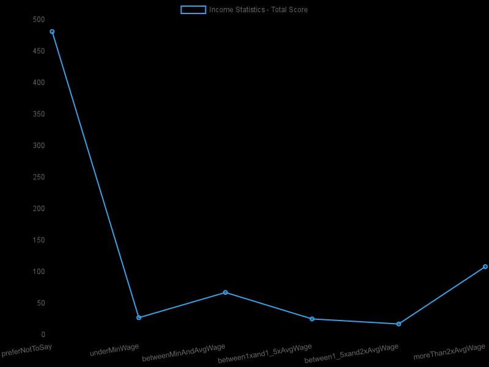
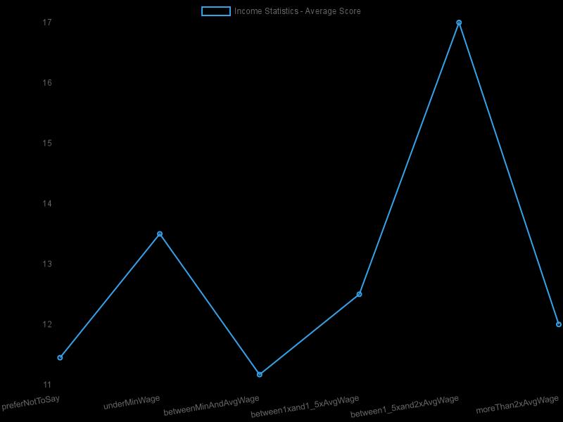

# Statistics:
- Average Score: 11.78
- Total Entries: 46

## AGE GROUP:
 | Age Group | Score total | Count | Average Score |
 | --- | --- | --- | --- |
| preferNotToSay  | 69 | 6 | 11.50 |
| under18         | 42 | 3 | 14.00 |
| 18-24           | 75 | 5 | 15.00 |
| 25-34           | 139 | 12 | 11.58 |
| 35-44           | 82 | 8 | 10.25 |
| 45-54           | 66 | 6 | 11.00 |
| 55-64           | 44 | 4 | 11.00 |
| 65+             | 25 | 2 | 12.50 |

 | Total Score | Average Score |
 | --- | --- |
 |  |  |

## GENDER:
 | Gender | Score total | Count | Average Score |
 | --- | --- | --- | --- |
| preferNotToSay  | 90 | 7 | 12.86 |
| female          | 130 | 13 | 10.00 |
| Male            | 299 | 24 | 12.46 |
| NonBinary       | 23 | 2 | 11.50 |

 | Total Score | Average Score |
 | --- | --- |
 |  |  |

## EDUCATION:
 | Education | Score total | Count | Average Score |
 | --- | --- | --- | --- |
| preferNotToSay  | 97 | 8 | 12.13 |
| lessThanHighSchool | 55 | 4 | 13.75 |
| highSchool      | 80 | 6 | 13.33 |
| universityDegree | 176 | 15 | 11.73 |
| postgraduateDegree | 134 | 13 | 10.31 |

 | Total Score | Average Score |
 | --- | --- |
 |  |  |

## INCOME:
 | Income | Score total | Count | Average Score |
 | --- | --- | --- | --- |
| preferNotToSay  | 349 | 30 | 11.63 |
| underMinWage    | 27 | 2 | 13.50 |
| betweenMinAndAvgWage | 54 | 5 | 10.80 |
| between1xand1_5xAvgWage | 13 | 1 | 13.00 |
| between1_5xand2xAvgWage | 0 | 0 | NaN |
| moreThan2xAvgWage | 99 | 8 | 12.38 |

 | Total Score | Average Score |
 | --- | --- |
 |  |  |

## EMPLOYMENT STATUS:
 | Employment Status | Score total | Count | Average Score |
 | --- | --- | --- | --- |
| preferNotToSay  | 79 | 7 | 11.29 |
| employed        | 244 | 22 | 11.09 |
| selfEmployed    | 11 | 1 | 11.00 |
| unemployed      | 33 | 3 | 11.00 |
| student         | 131 | 9 | 14.56 |
| retired         | 44 | 4 | 11.00 |

 | Total Score | Average Score |
 | --- | --- |
 |  |  |

## LOCATION:
 | Location | Score total | Count | Average Score |
 | --- | --- | --- | --- |
| prefer_not_say  | 117 | 10 | 11.70 |
| eastern_europe  | 374 | 32 | 11.69 |
| central_europe  | 15 | 1 | 15.00 |
| western_europe  | 0 | 0 | NaN |
| northern_europe | 0 | 0 | NaN |
| southern_europe | 0 | 0 | NaN |
| north_america   | 11 | 1 | 11.00 |
| central_america_caribbean | 0 | 0 | NaN |
| south_america   | 0 | 0 | NaN |
| northern_africa | 0 | 0 | NaN |
| sub_saharan_africa | 14 | 1 | 14.00 |
| middle_east     | 0 | 0 | NaN |
| central_asia    | 0 | 0 | NaN |
| south_asia      | 11 | 1 | 11.00 |
| southeast_asia  | 0 | 0 | NaN |
| east_asia       | 0 | 0 | NaN |
| oceania         | 0 | 0 | NaN |

 | Total Score | Average Score |
 | --- | --- |
 |  |  |

## Score:
 | Score | Count | 
 | --- | --- |
| 1               |0 |
| 2               |1 |
| 3               |0 |
| 4               |1 |
| 5               |0 |
| 6               |0 |
| 7               |1 |
| 8               |3 |
| 9               |3 |
| 10              |6 |
| 11              |7 |
| 12              |7 |
| 13              |2 |
| 14              |6 |
| 15              |4 |
| 16              |3 |
| 17              |0 |
| 18              |0 |
| 19              |1 |
| 20              |1 |
| 21              |0 |
| 22              |0 |
| 23              |0 |
| 24              |0 |

  |

