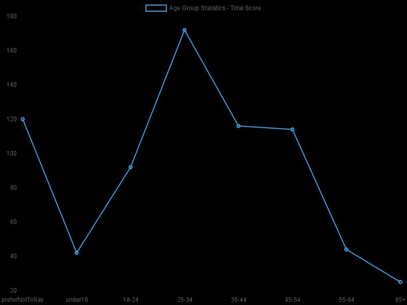
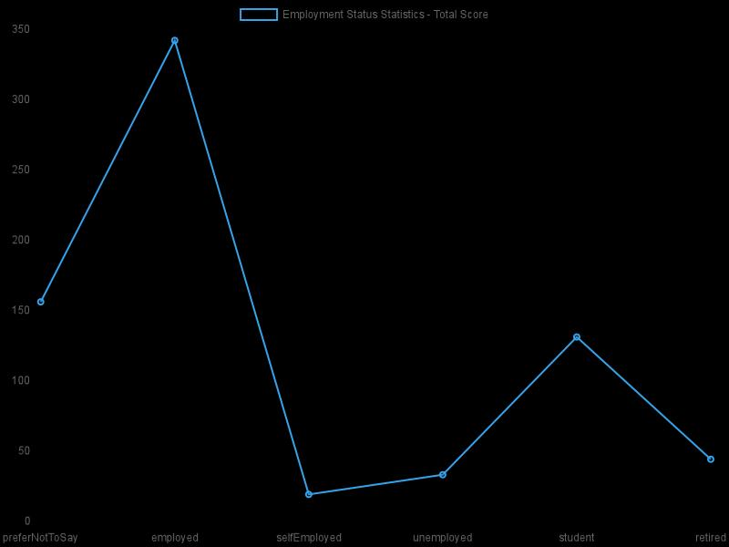
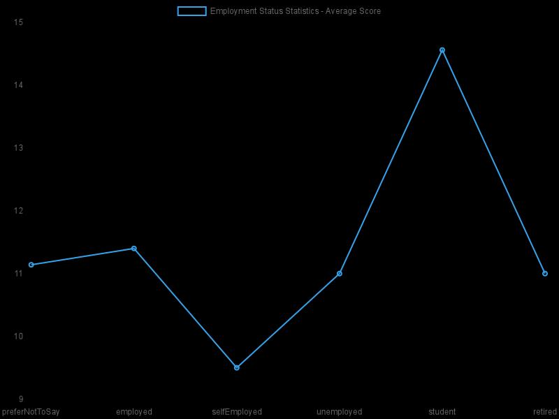
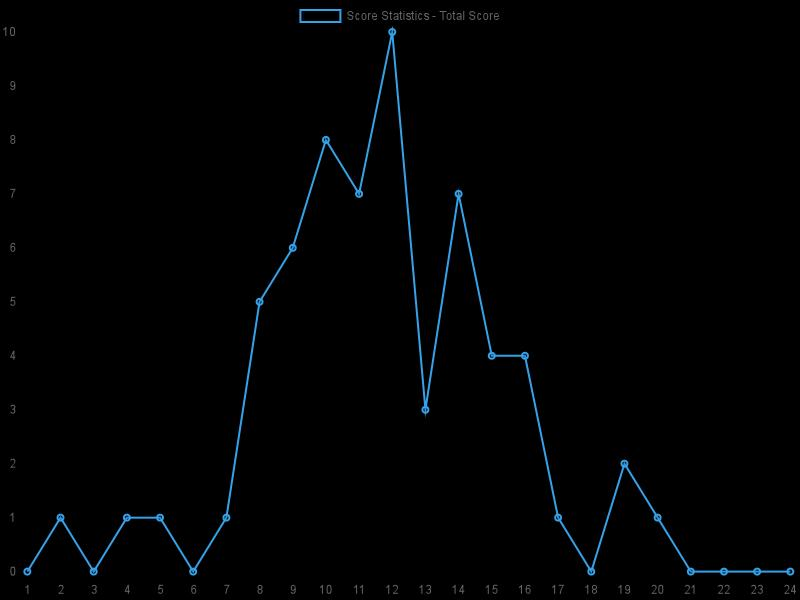

# Statistics:
- Average Score: 11.69
- Total Entries: 62

## AGE GROUP:
 | Age Group | Score total | Count | Average Score |
 | --- | --- | --- | --- |
| preferNotToSay  | 120 | 11 | 10.91 |
| under18         | 42 | 3 | 14.00 |
| 18-24           | 92 | 6 | 15.33 |
| 25-34           | 172 | 15 | 11.47 |
| 35-44           | 116 | 11 | 10.55 |
| 45-54           | 114 | 10 | 11.40 |
| 55-64           | 44 | 4 | 11.00 |
| 65+             | 25 | 2 | 12.50 |

 | Total Score | Average Score |
 | --- | --- |
 |  |  |

## GENDER:
 | Gender | Score total | Count | Average Score |
 | --- | --- | --- | --- |
| preferNotToSay  | 141 | 12 | 11.75 |
| female          | 138 | 14 | 9.86 |
| Male            | 406 | 33 | 12.30 |
| NonBinary       | 40 | 3 | 13.33 |

 | Total Score | Average Score |
 | --- | --- |
 |  |  |

## EDUCATION:
 | Education | Score total | Count | Average Score |
 | --- | --- | --- | --- |
| preferNotToSay  | 162 | 14 | 11.57 |
| lessThanHighSchool | 55 | 4 | 13.75 |
| highSchool      | 90 | 7 | 12.86 |
| universityDegree | 227 | 19 | 11.95 |
| postgraduateDegree | 191 | 18 | 10.61 |

 | Total Score | Average Score |
 | --- | --- |
 |  |  |

## INCOME:
 | Income | Score total | Count | Average Score |
 | --- | --- | --- | --- |
| preferNotToSay  | 481 | 42 | 11.45 |
| underMinWage    | 27 | 2 | 13.50 |
| betweenMinAndAvgWage | 67 | 6 | 11.17 |
| between1xand1_5xAvgWage | 25 | 2 | 12.50 |
| between1_5xand2xAvgWage | 17 | 1 | 17.00 |
| moreThan2xAvgWage | 108 | 9 | 12.00 |

 | Total Score | Average Score |
 | --- | --- |
 |  |  |

## EMPLOYMENT STATUS:
 | Employment Status | Score total | Count | Average Score |
 | --- | --- | --- | --- |
| preferNotToSay  | 156 | 14 | 11.14 |
| employed        | 342 | 30 | 11.40 |
| selfEmployed    | 19 | 2 | 9.50 |
| unemployed      | 33 | 3 | 11.00 |
| student         | 131 | 9 | 14.56 |
| retired         | 44 | 4 | 11.00 |

 | Total Score | Average Score |
 | --- | --- |
 |  |  |

## LOCATION:
 | Location | Score total | Count | Average Score |
 | --- | --- | --- | --- |
| prefer_not_say  | 187 | 17 | 11.00 |
| eastern_europe  | 454 | 39 | 11.64 |
| central_europe  | 15 | 1 | 15.00 |
| western_europe  | 16 | 1 | 16.00 |
| northern_europe | 0 | 0 | NaN |
| southern_europe | 17 | 1 | 17.00 |
| north_america   | 11 | 1 | 11.00 |
| central_america_caribbean | 0 | 0 | NaN |
| south_america   | 0 | 0 | NaN |
| northern_africa | 0 | 0 | NaN |
| sub_saharan_africa | 14 | 1 | 14.00 |
| middle_east     | 0 | 0 | NaN |
| central_asia    | 0 | 0 | NaN |
| south_asia      | 11 | 1 | 11.00 |
| southeast_asia  | 0 | 0 | NaN |
| east_asia       | 0 | 0 | NaN |
| oceania         | 0 | 0 | NaN |

 | Total Score | Average Score |
 | --- | --- |
 |  |  |

## Score:
 | Score | Count | 
 | --- | --- |
| 1               |0 |
| 2               |1 |
| 3               |0 |
| 4               |1 |
| 5               |1 |
| 6               |0 |
| 7               |1 |
| 8               |5 |
| 9               |6 |
| 10              |8 |
| 11              |7 |
| 12              |10 |
| 13              |3 |
| 14              |7 |
| 15              |4 |
| 16              |4 |
| 17              |1 |
| 18              |0 |
| 19              |2 |
| 20              |1 |
| 21              |0 |
| 22              |0 |
| 23              |0 |
| 24              |0 |

  |

